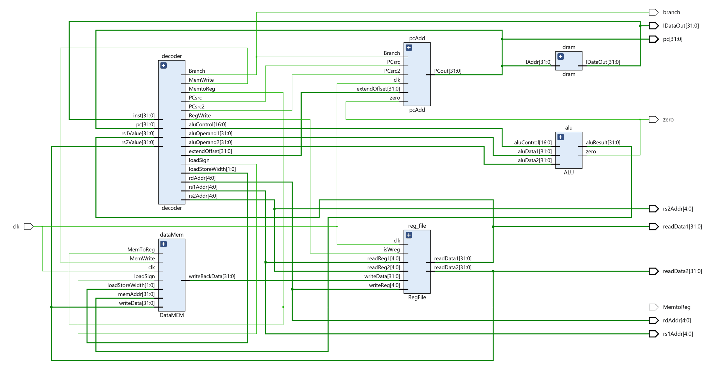
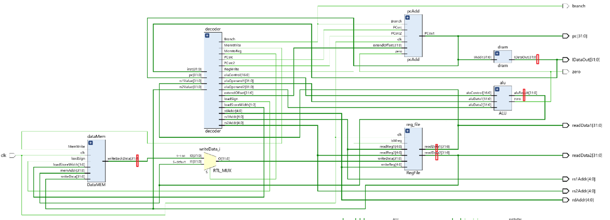
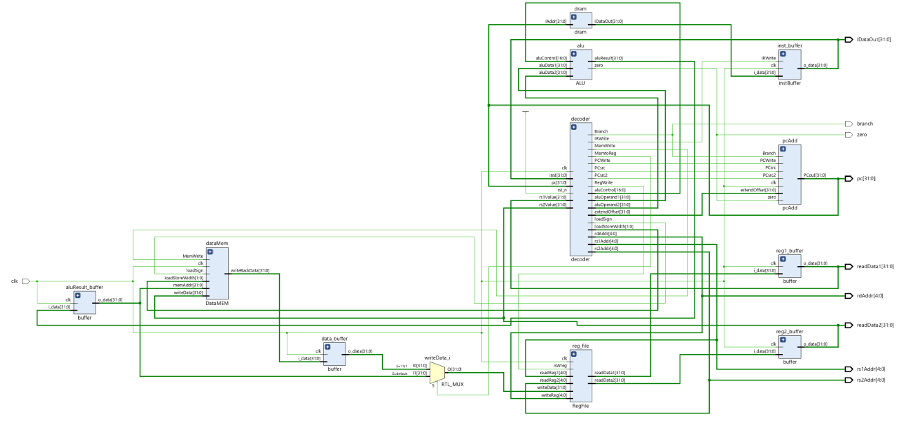
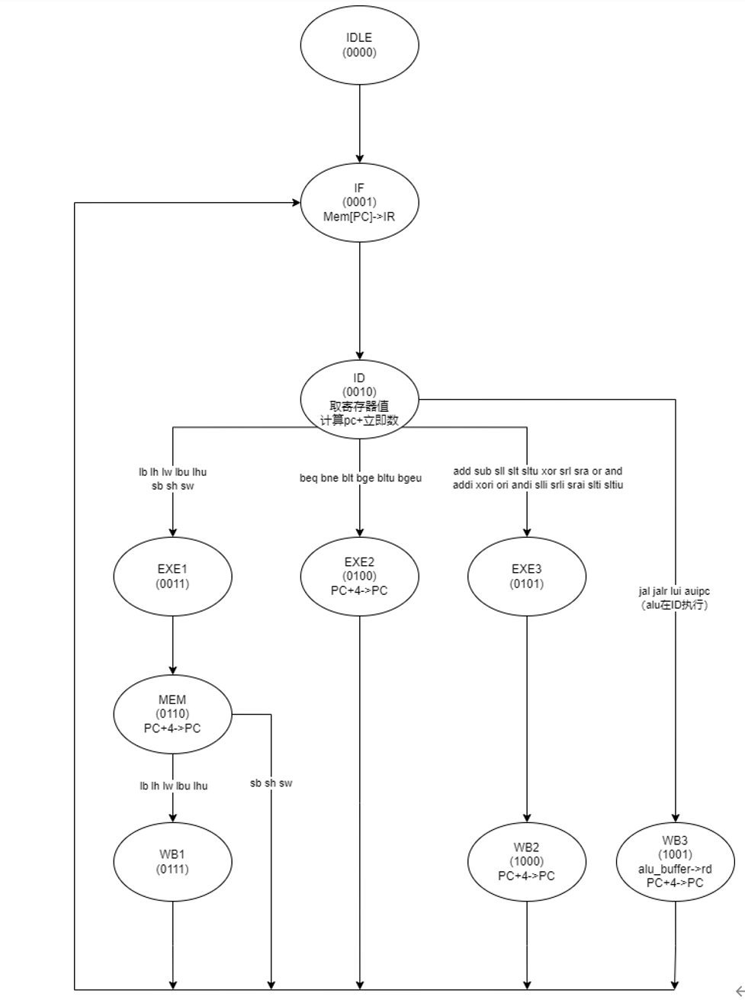
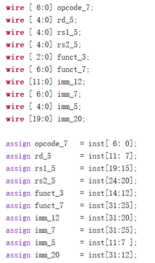
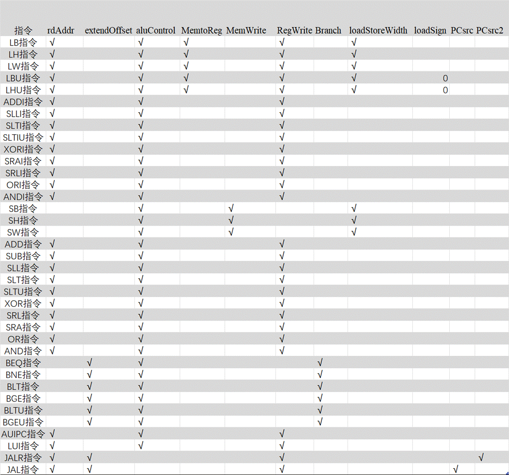

# multi-cycle-CPU

## 本次课程设计完成以下工作

a)    基于上一次的单周期CPU设计，实现了RISC-V架构RV32I指令集的**多周期CPU**，频率为71.4MHZ，CPI根据指令的不同为3-5之间，并**通过了RISC-V官方指令集测试**。该CPU实现了RV32I指令集47条指令中的除CSR、ECALL等操作系统相关指令外所有的用户程序指令，一共38条，**理论上可以运行任何没有中断与异常的程序**。


b)   编译了RISC-V GNU Compiler Toolchain并在Spike模拟器上运行了C程序；


c)    将C程序编译为机器码写入COE文件，在Vivado行为仿真中正确运行。


d)   编写单独的RISC-V汇编程序来调用C语言程序，解决栈指针非法访问的问题。

## 设计思路

之前的单周期CPU结构如下图。



ALU的运算结果总会通过数据存储器，由数据存储器内部的多路选择器决定是输出ALU的运算结果还是输出数据存取器取出的值传到寄存器堆。

由于需要增加级间寄存器，原先的设计不太好，我们先将数据存储器内部的多路选择器提取出来，如下图。



再在上图红色处添加级间寄存器。

最后多周期CPU的结构如下图。reg_buffer负责暂存从寄存器堆中读出来的值；inst_buffer负责暂存指令；data_buffer负责暂存从数据存储器中的值。



给单周期CPU的译码器增加时钟信号，增加状态机设计。



由于在单周期CPU设计中，pc的更改是用的pc内部的加法器，没有使用ALU的，所以更改pc的步骤可以与exe阶段同时执行。

## 模块设计

总共分为10个模块，分别是：instMem（指令寄存器）、PcAdd （控制PC跳转）、ALU（算数逻辑单元）、DataMem（数据存储器）、RegFile（寄存器）、Top（顶层模块）、Decode（译码器）、inst_buffer（指令寄存器）、data_buffer（数据寄存器）、reg_buffer

单周期CPU原有的模块主要修改了译码器模块，其他模块几乎没有修改。增加了级间寄存器。其中inst_buffer有写使能信号，data_buffer和reg_buffer都没有写使能信号。

- **Decode**

译码器包含的内容比较多。

a.    译码器读取指令后，会对指令进行如下分割。



b.    根据以下情况对指令进行分类

-  alu操作种类（add、sub、slt、xor、beq...)

- 指令类型（RISUJB）

- rs1、rs2、rd、imm、shamt、extendoffset是否存在

- loadstore相关：字长、半字、字节读写，有无符号拓展

- 第一操作数是否为pc

c.    分好类后，不同的类别会有不同的输出信号和输出数据。


d.    增加存储译码器当前所处状态的寄存器c_state和下一状态的寄存器n_state。

```verilog
 reg [3:0] c_state,n_state;
    
    initial begin
        n_state <= idle_state;
        c_state <= idle_state;
end

     always@(posedge clk or negedge rst_n)
     begin
        if(!rst_n)
            begin
                c_state <= if_state;
            end
        else
            begin
                c_state <= n_state;
            end
     end
```

e.    在单周期CPU设计的基础上，增加状态机，输出的控制信号中有以下四个信号与状态有关：

-  PCWrite

-  IRWrite

- MemWrite

- RegWrite

其他信号与状态无关，所以不用更改之前的设计。

状态机会严格按照上文的状态转换图中的条件进行状态转换。

f.    各状态输出信号：

```verilog
 always@(c_state)
     begin
            case(c_state)
            if_state   : begin
                PCWrite  = 0;
                IRWrite  = 1;
                MemWrite = 0;
                RegWrite = 0;
                end
            id_state   : begin
                PCWrite  = 0;
                IRWrite  = 0;
                MemWrite = 0;
                RegWrite = 0;
                end
            exe1_state : begin
                PCWrite  = 0;
                IRWrite  = 0;
                MemWrite = 0;
                RegWrite = 0;
                end
            exe2_state : begin
                PCWrite  = 1;
                IRWrite  = 0;
                MemWrite = 0;
                RegWrite = 0;
                end
            exe3_state : begin
                PCWrite  = 0;
                IRWrite  = 0;
                MemWrite = 0;
                RegWrite = 0;
                end
            mem_state  : begin
                PCWrite  = 1;
                IRWrite  = 0;
                MemWrite = SType ? 1 : 0;
                RegWrite = 0;
                end
            wb1_state  : begin
                PCWrite  = 0;
                IRWrite  = 0;
                MemWrite = 0;
                RegWrite = 1;
                end
            wb2_state  : begin
                PCWrite  = 1;
                IRWrite  = 0;
                MemWrite = 0;
                RegWrite = 1;
                end
            wb3_state  : begin
                PCWrite  = 1;
                IRWrite  = 0;
                MemWrite = 0;
                RegWrite = 1;
                end                
            default    : begin
                PCWrite  = 0;
                IRWrite  = 0;
                MemWrite = 0;
                RegWrite = 0;
                end
            endcase
     end

```

g.    



输入信号：

| w_PC     | pc的值        |
| -------- | ------------- |
| inst     | 指令的值      |
| rs1Value | 地址rs1的数据 |
| rs2Value | 地址rs2的数据 |

输出信号：

| rs1Addr        | 地址rs1                  |
| -------------- | ------------------------ |
| rs2Addr        | 地址rs2                  |
| rdAddr         | 地址rd                   |
| rs2Value       | 地址rs2的数据            |
| aluOperand1    | alu操作数1               |
| aluOperand2    | alu操作数2               |
| extendOffset   | 跳转指令的扩展偏移       |
| aluControl     | alu控制信号              |
| MemtoReg       | 从数据存储器中读的读信号 |
| MemWrite       | 存储器写信号             |
| RegWrite       | 寄存器写信号             |
| Branch         | 跳转分支信号             |
| loadStoreWidth | 读写宽度标志             |
| loadSign       | Load拓展方式             |
| PCsrc          | jal跳转信号              |
| PCsrc2         | jalr跳转信号             |
